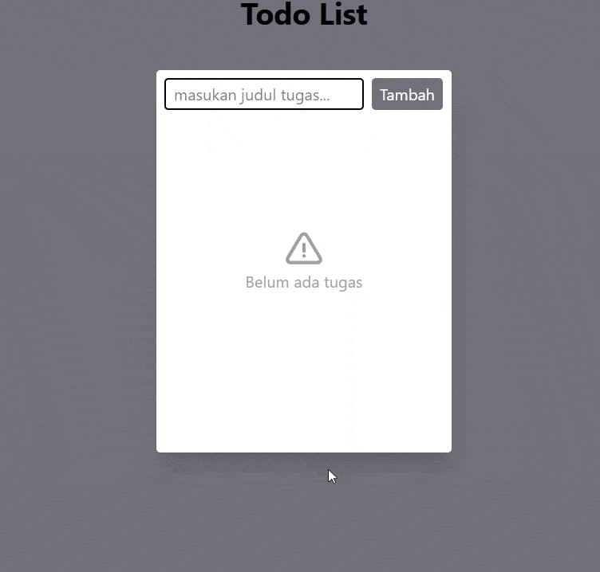

# Todo List App



A simple Todo List web application built to practice full-stack web development using JavaScript, Node.js, Express, and MongoDB.

This project allows users to create, view, update, and delete tasks through a simple and responsive interface.

## ✨ Features

- Add new tasks
- Display all tasks
- Mark tasks as completed
- Delete tasks
- Store tasks in MongoDB
- REST API for task management
- Responsive user interface
- Empty state when there are no tasks

## 🛠️ Technologies

### Frontend

- HTML
- JavaScript (ES Modules)
- Tailwind CSS

### Backend

- Node.js
- Express.js
- Mongoose

### Database

- MongoDB

## 📁 Project Structure

```text
todo-list/
├── public/
│   ├── index.html
│   ├── src/
│   │   └── js/
│   │       ├── main.js
│   │       ├── api.js
│   │       ├── handler.js
│   │       └── ui.js
│   └── css/
|        ├── input.css
│        └── output.css
├── config/
│   └── db.js
│
├── controllers/
│   └── task-controller.js
│
├── routes/
│   └── task-route.js
│
├── .env
├── .gitignore
├── package.json
└── server.js

```
